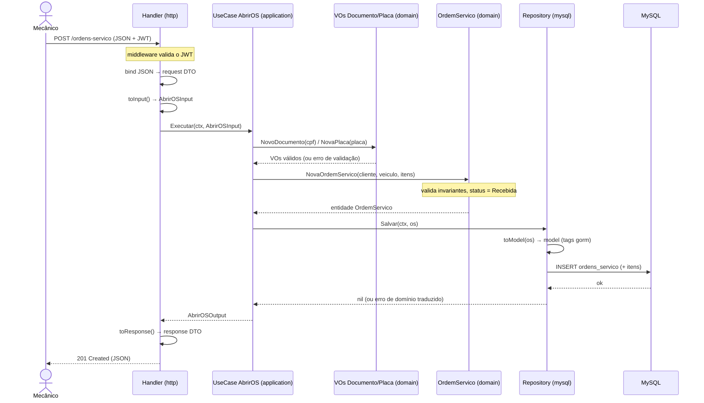

# Arquitetura — Sistema de Oficina Mecânica (Tech Challenge Fase 1)

Back-end monolítico em **arquitetura em camadas** com DDD tático. **Stack:** Go + Gin + GORM + MySQL 8.

> Versão **MVP**: o enunciado permite "monolito em camadas". Mantivemos o esqueleto de camadas e o núcleo tático de DDD.

---

## Decisões-chave

### Framework web — Gin
- Escolhido pela maturidade e volume de material (Swagger, JWT, middleware). Echo seria igualmente válido.
- **Regra inegociável:** Gin vive só na infraestrutura. `gin.Context` nunca entra em use case nem no domínio.

### Banco — MySQL 8 (InnoDB)
- Domínio relacional com necessidade de consistência transacional (gerar orçamento + baixar estoque atômico → ACID + FKs).
- Driver Go maduro, fácil no `docker-compose`, ubíquo em PMEs. MySQL 8 tem CTEs, window functions e CHECK constraints.

### GORM sem vazamento — Persistence Model + Mapper
- Entidade de domínio pura, sem tag `gorm:`. Struct de persistência (`model.go`) vive na infra.
- O `mapper.go` converte entidade ↔ model; o `repository.go` faz query e tradução de erro.
- **Reconstituir ≠ criar:** o mapper usa um construtor de reconstituição (não gera ID novo, não reseta status).
- **Traduzir erros na fronteira:** `gorm.ErrRecordNotFound` etc. viram erros de domínio.
- Evitar `AutoMigrate`: schema versionado em `.sql` explícito (com `down`).

### Injeção de dependência
- Repositório injetado no use case via construtor, como **interface** (definida no domínio).
- Use Case injetado no handler via construtor, como **interface** (definida no handler — consumidor).

### Três fronteiras de mapeamento (cada uma dona de uma camada)
1. Handler (infra): HTTP DTO ↔ DTO da aplicação.
2. Use case (aplicação): DTO de entrada → **entidade de domínio** (nunca para o model).
3. Repositório (infra): entidade ↔ model (GORM).

### Handlers magros — DTO e mapper de transporte
- Para não inflar os handlers, cada agregado tem no pacote `http` dois arquivos além do handler: `*_dto.go` (structs de request/response com tags `json:`) e `*_mapper.go` (converte HTTP DTO ↔ DTO da aplicação, via `toInput()`/`toResponse()`).
- O handler fica magro: `bind → toInput() → use case → toResponse() → resposta`.
- **Dois DTOs, duas camadas — não confundir:** `application/ordemservico/dto.go` são os DTOs **da aplicação** (contrato do use case, agnóstico de HTTP); `http/ordem_servico_dto.go` são os DTOs **de transporte** (request/response HTTP). O mapper de transporte é a fronteira 1 entre eles.
- O mapper de transporte é **DTO ↔ DTO**: nunca importa entidade de domínio nem constrói Value Object — passa primitivos; a validação (CPF/CNPJ, placa) fica no use case/VO. Mantê-lo **fino** (quase cópia) é o preço de manter a aplicação agnóstica de transporte.
- Se o pacote `http` crescer demais, dá para namespacear `http/` por agregado (como na persistência); custa apenas aliases de import no `principal.go`.

### Regra de dependência
- `infrastructure` → importa `application` e `domain`.
- `application` → importa só `domain`.
- `domain` → não importa nada de dentro do projeto.

### Value Objects auto-validáveis
- `Documento` (CPF/CNPJ), `Placa`, `Dinheiro`. Nascem válidos ou não nascem. Validação de dados sensíveis (CPF/CNPJ, placa) mora aqui.
- `Status` (com máquina de estados) é VO **exclusivo da Ordem de Serviço** — vive em `ordemservico/status.go`, **não** em `shared/` (uma Peça não tem "Em diagnóstico").

### Segurança e qualidade
- JWT (`golang-jwt/v5`) nas APIs administrativas.
- Testes de integração com `testcontainers` (MySQL real) + `testify`. Meta: cobertura ≥ 80% nos domínios críticos.
- Swagger via `swaggo`; migrations via `golang-migrate`.

### Convenção de nomes (regra híbrida)
- **Scaffolding técnico em inglês:** camadas e infra (`domain`, `application`, `infrastructure`, `persistence`) e artefatos de padrão (`repository.go`, `mapper.go`, `model.go`, `router.go`, `jwt.go`, `config.go`, `connection.go`).
- **Negócio em português** (Linguagem Ubíqua): pacotes de agregado (`ordemservico`, `cliente`…) e arquivos de conceito (`ordem_servico.go`, `status.go`, `documento.go`). `shared/` fica em inglês por ser agrupamento técnico; os VOs dentro dele têm nome de negócio (PT).
- **Pasta namespaceada por agregado → nome de arquivo genérico** (`model.go`, `repository.go`). **Pasta plana → prefixo por entidade** (ex.: `http/ordem_servico_handler.go`) para desambiguar.
- **Pacotes** (= nome da pasta) em ASCII minúsculo, sem acento e sem underscore. **Arquivos** podem usar underscore.
- `cmd/api/principal.go`: o arquivo tem nome PT, mas `package main` e `func main()` são fixos da linguagem.

---

## Fluxo da aplicação — exemplo: criar Ordem de Serviço

Sequência de uma requisição de criação de OS atravessando as camadas. Mostra as três fronteiras de mapeamento (HTTP DTO → DTO da aplicação → entidade → model), a validação nos Value Objects e o invariante de status inicial (`Recebida`).



---

## Simplificações do MVP (cortadas propositalmente)

Autorizadas pela permissão de "monolito em camadas" do enunciado; nenhuma delas afeta o que é avaliado em DDD:

- **Unit of Work formal** → a única transação multi-agregado (reserva de peça) resolve com um método transacional simples usando a `tx` do GORM.
- **Eventos de domínio como objetos (`eventos.go`)** → o Event Storming continua como artefato de modelagem; no código, as políticas são orquestração direta dentro do use case (sem event bus).

---

## Estrutura de pastas (MVP)

Um agregado (`ordemservico`) é mostrado como referência; os demais (`cliente`, `veiculo`, `servico`, `peca`) seguem exatamente o mesmo padrão.

```
tech-challenge-oficina/
├── cmd/
│   └── api/
│       └── main.go                               # composition root: wiring / injeção de dependência
│
├── internal/
│   ├── domain/                                   # núcleo puro — sem gin/gorm
│   │   ├── ordemservico/                         # agregado de referência
│   │   │   ├── ordem_servico.go                  # entidade + agregado raiz; invariantes
│   │   │   ├── status.go                         # VO Status + máquina de estados (exclusivo da OS)
│   │   │   ├── repository.go                     # INTERFACE do repositório (sem GORM)
│   │   │   ├── errors.go                         # erros de domínio (ErrNaoEncontrada, ErrStatusInvalido...)
│   │   │   └── ordem_servico_test.go             # teste unitário (invariantes + transições de status)
│   │   ├── cliente/                              # mesmo padrão: entidade + repository + errors + _test
│   │   ├── veiculo/
│   │   ├── servico/
│   │   ├── peca/                                 # inclui estoque.go (VO físico/reservado/disponível)
│   │   └── shared/                               # value objects de negócio reutilizáveis
│   │       ├── documento.go                      # VO CPF/CNPJ (auto-validável)
│   │       ├── placa.go                          # VO Placa
│   │       ├── dinheiro.go                       # VO Dinheiro (orçamento, preços de serviço/peça)
│   │       └── documento_test.go                 # teste unitário dos VOs (validação CPF/CNPJ, placa)
│   │
│   ├── application/                              # casos de uso — orquestra o domínio, não conhece GORM
│   │   ├── ordemservico/
│   │   │   ├── dto.go                            # DTOs DA APLICAÇÃO (input/output do use case)
│   │   │   ├── abrir_ordem_servico.go            # caso de uso concreto (injeta o repositório)
│   │   │   └── abrir_ordem_servico_test.go       # teste unitário (repositório mockado)
│   │   ├── cliente/                              # mesmo padrão: dto.go, *_caso_uso.go, *_test.go
│   │   ├── veiculo/
│   │   ├── servico/
│   │   └── peca/
│   │
│   └── infrastructure/                           # bordas — aqui vivem gin, gorm, jwt
│       ├── persistence/
│       │   └── mysql/
│       │       ├── connection.go                 # conexão GORM/MySQL + método transacional (tx)
│       │       ├── ordemservico/
│       │       │   ├── model.go                  # struct de persistência com tags `gorm:"..."`
│       │       │   ├── mapper.go                 # mapeia entidade↔model; construtor de reconstituição
│       │       │   ├── repository.go             # implementa a interface; query + tradução de erro
│       │       │   ├── mapper_test.go            # teste unitário do mapeamento entidade↔model
│       │       │   └── repository_test.go        # teste unitário (query + tradução de erro de GORM)
│       │       ├── cliente/                      # mesmo padrão: model + mapper + repository + _test
│       │       ├── veiculo/
│       │       ├── servico/
│       │       └── peca/
│       ├── http/                                 # entrega REST com Gin — handlers magros
│       │   ├── router.go                         # rotas + middlewares
│       │   ├── ordem_servico_handler.go          # handler magro (bind → toInput → use case → toResponse)
│       │   ├── ordem_servico_dto.go              # DTOs DE TRANSPORTE (request/response HTTP, tags json)
│       │   ├── ordem_servico_mapper.go           # HTTP DTO ↔ DTO da aplicação (toInput/toResponse)
│       │   ├── ordem_servico_handler_test.go     # teste do handler (use case mockado, httptest)
│       │   ├── ordem_servico_mapper_test.go      # teste do mapeamento de transporte
│       │   ├── authentication_handler.go         # login + emissão do JWT
│       │   └── middleware/
│       │       ├── authentication_middleware.go  # valida JWT nas rotas administrativas
│       │       ├── error_mapper.go               # erro de domínio → status HTTP (404, 409, 422...)
│       │       └── error_mapper_test.go          # teste unitário do mapeamento de erros
│       ├── authentication/
│       │   ├── jwt.go                            # geração/validação de token (golang-jwt/v5)
│       │   └── jwt_test.go                       # teste unitário (emitir/validar/expirar token)
│       └── config/
│           ├── config.go                         # carrega variáveis de ambiente (caarlos0/env)
│           └── config_test.go                    # teste unitário (parsing/defaults das envs)
│
├── migrations/                                   # schema MySQL versionado (.sql na raiz)
│   ├── 000001_create_customers.up.sql
│   └── 000001_create_customers.down.sql
│
├── test/
│   └── integration/                              # testes de integração (testcontainers sobe MySQL real)
│       └── service_order_flow_test.go            # fluxo salvar→carregar→transicionar de ponta a ponta
│
├── docs/                                         # documentação técnica (humana)
│   ├── ARQUITETURA.md                            # esta síntese arquitetural
│   ├── event-storming.md                         # links/export do board do Miro
│   ├── adr/                                      # Architecture Decision Records
│   │   ├── 0001-monolito-em-camadas.md
│   │   ├── 0002-mysql-como-banco.md
│   │   └── 0003-gorm-com-persistence-model.md
│   └── swagger/                                  # gerado por `swag init` (docs.go, swagger.json/yaml)
│
├── .env.example
├── .gitignore
├── Dockerfile                                    # build multi-stage da aplicação
├── docker-compose.yml                            # app + MySQL
├── Makefile                                      # atalhos: run, test, migrate, swagger, lint
├── go.mod
├── go.sum
└── README.md
```

> **Migrations:** `.sql` versionado em `migrations/` na raiz (onde o avaliador procura). Migration é detalhe de persistência: vive fora do domínio.
>
> **Testes:** cada pacote tem um `*_test.go` de exemplo (unitário, ao lado do código); os de integração ficam em `test/integration/` (se tiver).
