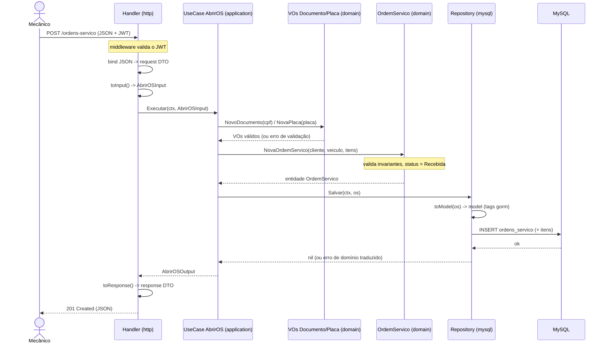

# Arquitetura: Sistema de Oficina Mecânica (Tech Challenge Fase 1)

Back-end monolítico em arquitetura em camadas com DDD tático. Stack: Go, Gin, GORM, MySQL 8.

Versão MVP: o enunciado permite "monolito em camadas". O esqueleto de camadas e o núcleo tático de DDD foram mantidos.

As decisões estruturais (monólito em camadas, MySQL, GORM sem vazamento, Gin, convenção de nomes) estão registradas em `docs/adr/`. Este documento cobre as convenções internas que dão suporte a essas decisões.

---

## Injeção de dependência

- Repositório injetado no use case via construtor, como interface definida no domínio.
- Use case injetado no handler via construtor, como interface definida no handler (o consumidor).

## Três fronteiras de mapeamento

Cada uma dona de uma camada:
1. Handler (infra): HTTP DTO em DTO da aplicação.
2. Use case (aplicação): DTO de entrada em entidade de domínio, nunca vira model.
3. Repositório (infra): entidade em model do GORM.

## Handlers magros: DTO e mapper de transporte

- `internal/infrastructure/http/` é namespaceado por agregado: cada domínio ganha sua própria pasta/pacote (`http/ordemservico/`, `http/auth/`, `http/health/`...), com `dto.go` (structs de request/response com tags `json:`), `mapper.go` (converte HTTP DTO em DTO da aplicação, via `toInput()`/`toResponse()`) e o(s) handler(s). Dentro da pasta do domínio os nomes ficam sem prefixo.
- O handler fica magro: bind, `toInput()`, use case, `toResponse()`, resposta.
- Dois DTOs, duas camadas, não confundir: `application/ordemservico/dto.go` são os DTOs da aplicação, contrato do use case, agnóstico de HTTP. `http/ordemservico/dto.go` são os DTOs de transporte, request/response HTTP. O mapper de transporte é a fronteira 1 entre eles.
- O mapper de transporte é DTO para DTO: nunca importa entidade de domínio nem constrói Value Object, só passa primitivos. A validação (CPF/CNPJ, placa) fica no use case ou no VO. Mantê lo fino, quase uma cópia, é o preço de manter a aplicação agnóstica de transporte.
- `internal/infrastructure/http/httperror/` é a exceção: fica fora de qualquer pasta de domínio, de propósito, pra evitar ciclo de import entre `router.go` e os domínios (que precisam de `RespondError` pra responder erro).

## Regra de dependência

- `infrastructure` importa `application` e `domain`.
- `application` importa só `domain`.
- `domain` não importa nada de dentro do projeto.

## Value Objects auto validáveis

- `Documento` (CPF/CNPJ), `Placa`, `Dinheiro`. Nascem válidos ou não nascem. Validação de dados sensíveis mora aqui.
- `Status`, com máquina de estados, é VO exclusivo da Ordem de Serviço. Vive em `ordemservico/status.go`, não em `shared/`, já que uma Peça não tem "Em diagnóstico".
- `Email` e `SenhaHash` (`domain/shared/{email,senha_hash}.go`) são VOs de identidade/autenticação, reusados por qualquer agregado com login por senha. `PapelUsuario` também mora em `shared` pelo mesmo motivo: é atributo do usuário, não do contexto de autenticação, e tanto `domain/auth` quanto `domain/usuario` precisam dele sem um depender do outro. Regra geral: um VO só desce pra dentro do agregado (`ordemservico/status.go`) quando é exclusivo dele; se dois agregados vão precisar do mesmo VO, ele nasce em `shared/` desde o início.

## Segurança e qualidade

- JWT (`golang-jwt/v5`) nas APIs administrativas. `AuthenticationMiddleware` reavalida se o usuário ainda está ativo a cada request (via `UsuarioStatusRepository`), não só no login; um usuário inativado derruba sessões em curso, o access token não continua válido até expirar por conta própria.
- `AuthorizationMiddleware` é variádico: sempre checa `TipoUsuario` (interno/cliente); opcionalmente, uma lista de `PapelUsuario` permitidos, pra rotas restritas a um papel específico (ex.: gestão de usuário exige admin).
- Testes de integração com `testcontainers` (MySQL real) e `testify`. Meta de cobertura: 80% ou mais nos domínios críticos.
- Swagger via `swaggo`, migrations via `golang-migrate`.
- SCA/SAST/DAST (`govulncheck`, `gosec`, OWASP ZAP) via `make sec-sca`/`sec-sast`/`sec-dast`; detalhes e justificativa de cada ferramenta em [`docs/SECURITY.md`](./SECURITY.md). O DAST roda numa stack Docker isolada (`security/compose.dast.yml`) pra não sujar o banco de desenvolvimento; SonarQube fica em `quality/compose.quality.yml` (`make sonar-up`/`sonar-scan`).

## Credenciais e status de usuário: adapter por fonte de identidade

`domain/auth` define duas interfaces que ele mesmo consome mas não implementa, porque implementá-las exigiria depender de um domínio de negócio (`usuario`, `cliente`), o que quebraria a regra de dependência (`domain` não importa nada do projeto):

- `CredenciaisRepository.BuscarPorEmail` — usado pelo `LoginUseCase`.
- `UsuarioStatusRepository.EstaAtivo` — usado pelo `AuthenticationMiddleware` a cada request.

Cada fonte de identidade (usuário interno, cliente) implementa as duas via um adapter em infraestrutura. O wiring decide, por endpoint, qual adapter injetar (`LoginUseCase` de `/v1/auth/login` recebe o adapter de `usuario`; o de `/v1/auth/cliente/login` receberia o de `cliente`, quando existir).

## Testes de integração

Unitário com mock prova a lógica de cada peça isolada; não prova que as peças se encaixam. `test/integration/` (pacote `integration_test`, atrás da build tag `integration`, `make test-integration`) sobe um MySQL real via `testcontainers`, aplica as migrations de produção e monta `wiring.Container`/router exatamente como em produção — o teste bate no router de verdade, não numa função isolada.

Organização, um arquivo por responsabilidade:
- `setup_test.go`: `TestMain` — sobe o container e monta a aplicação uma vez por execução do pacote (subir um container por teste seria caro demais; testes compartilham o container e usam `resetDB` pra isolamento).
- `fixtures_test.go`: dados de teste (`resetDB`, `seedUsuario` — este último cria usuário direto via use case, sem depender de rota HTTP, pra não esbarrar no problema de "admin zero").
- `client_test.go`: helpers de request HTTP (`doRequest`, `doLogin`).
- Um arquivo por cenário de negócio.

Critério do que vira teste de integração: só o que só aparece quando as peças se juntam — wiring, SQL real contra o dialeto do MySQL, comportamento do middleware ao longo de múltiplas requisições. Validação de campo (senha fraca, nome vazio, papel inválido) já está 100% coberta no domínio, unitária; reprovar isso aqui seria desperdício de tempo de execução sem ganho de sinal. Foi essa disciplina que, na prática, achou um bug real: `Updates(struct)` do GORM ignora silenciosamente campos com valor zero (`false`, `""`) a menos que force com `.Select("*")` — inativar usuário (`ativo=false`) e destravar senha provisória (`requer_alterar_senha=false`) não estavam persistindo, e nenhum teste com `sqlmock` pegava isso porque só valida que uma query rodou, não as colunas que ela afeta.

## Convenção de nomes

Ver [ADR 0005](adr/0005-convencao-de-nomes.md).

---

## Fluxo da aplicação: exemplo criando uma Ordem de Serviço

Sequência de uma requisição de criação de OS atravessando as camadas. Mostra as três fronteiras de mapeamento (HTTP DTO, DTO da aplicação, entidade, model), a validação nos Value Objects e o invariante de status inicial (`Recebida`).



---

## Estrutura de pastas (MVP)

Um agregado (`ordemservico`) é mostrado como referência. Os demais (`cliente`, `veiculo`, `servico`, `peca`) seguem o mesmo padrão.

```
soat-architecture/
├── cmd/
│   ├── api/main.go
│   └── create-user/main.go    # cria usuario interno direto no banco (bootstrap do primeiro admin)
├── internal/
│   ├── domain/
│   │   ├── ordemservico/{ordem_servico,status,repository,errors}.go + _test
│   │   ├── usuario/{usuario,repository,errors}.go + _test  # usuário interno
│   │   ├── cliente/ veiculo/ servico/ peca/  (mesmo padrão)
│   │   └── shared/{documento,placa,dinheiro,email,senha_hash,papel_usuario,errors}.go + _test
│   ├── application/
│   │   ├── ordemservico/{dto,abrir_ordem_servico}.go + _test
│   │   ├── usuario/{dto,criar_usuario,atualizar_usuario,alterar_senha,ativar_usuario,inativar_usuario,buscar_usuario_logado}.go + _test
│   │   └── cliente/ veiculo/ servico/ peca/  (mesmo padrão)
│   └── infrastructure/
│       ├── persistence/mysql/{connection.go, ordemservico/, usuario/, cliente/, veiculo/, servico/, peca/, auth/}
│       │   └── usuario/{model,mapper,repository,credenciais_adapter}.go + _test  # CredenciaisAdapter implementa auth.CredenciaisRepository/UsuarioStatusRepository
│       ├── http/
│       │   ├── router.go            # monta o *gin.Engine, chama Register*Routes de cada domínio
│       │   ├── httperror/           # ErrorResponse + RespondError
│       │   ├── httprequest/         # helpers de request HTTP reusados entre domínios (ex.: ParseUintParam)
│       │   ├── auth/{interno_handler,cliente_handler,dto,mapper,routes}.go + _test
│       │   ├── health/{handler,routes}.go
│       │   ├── usuario/{handler,dto,mapper,routes}.go + _test    # gestão de usuário interno, restrito a admin + self-service
│       │   ├── ordemservico/{handler,dto,mapper,routes}.go  # mesmo padrão, demais domínios
│       │   └── middleware/{authentication_middleware,authorization_middleware,subject}.go + _test
│       ├── auth/jwt.go              # geração/validação de JWT, hash de refresh token
│       ├── wiring/container.go      # composition root: monta repositórios, adapters e use cases
│       └── config/config.go
├── migrations/
│   ├── main.go            # runner (go run ./migrations up|down|version|force N)
│   └── mysql/             # schema versionado, numerado (NNNNNN_nome.up/down.sql)
├── test/integration/      # testcontainers (MySQL real), build tag "integration"
├── docs/
│   ├── ARQUITETURA.md     # este documento
│   ├── SECURITY.md        # SCA/SAST/DAST: ferramentas e justificativa
│   ├── event-storming.md
│   └── adr/               # Architecture Decision Records
├── security/
│   ├── zap-scan.sh        # orquestra make sec-dast (stack isolada, 1 scan por papel)
│   ├── compose.dast.yml   # app-dast + mysql-dast + zap, projeto compose separado do dev
│   ├── zap-rules.tsv      # falsos positivos do ZAP marcados IGNORE
│   └── reports/           # saída de sec-sca/sec-sast/sec-dast (gitignored)
├── quality/
│   └── compose.quality.yml  # sonarqube + sonar-scanner (make sonar-up/sonar-scan)
├── .env.example
├── Dockerfile
├── compose.yml
├── Makefile
├── go.mod
└── README.md              # como rodar o projeto
```

Migrations: `.sql` versionado em `migrations/` na raiz, onde o avaliador procura. Migration é detalhe de persistência, vive fora do domínio.

Testes: cada pacote tem um `*_test.go` de exemplo, unitário, ao lado do código. Os de integração ficam em `test/integration/` — ver seção "Testes de integração" acima.

## Wiring e rotas

Composição de dependências (config, conexão de banco e, futuramente, repositórios e use cases por domínio) fica centralizada no `Container`, em `internal/infrastructure/wiring/container.go`. É o único lugar que monta o grafo de dependências da aplicação; `main.go` cria o `Container` e passa pra `httpinfra.NewRouter`.

Rotas são registradas por domínio: cada domínio tem seu próprio pacote dentro de `internal/infrastructure/http/<dominio>/` (ex: `http/health/routes.go`), com uma função `Register<Dominio>Routes(rg *gin.RouterGroup, c *wiring.Container)`. `router.go` (raiz) só monta o `*gin.Engine`, aplica middlewares globais e chama cada `<dominio>.Register<Dominio>Routes`: não conhece detalhe de nenhum domínio, só importa o pacote de cada um.

Ao implementar um novo domínio (ex: `cliente`):

1. Adicione os campos necessários (repositório, use cases) no `Container` e construa-os em `NewContainer`.
2. Crie `internal/infrastructure/http/cliente/routes.go` com `RegisterClienteRoutes`.
3. Registre a chamada em `router.go` (raiz), importando o pacote `cliente`.

Cuidado com ciclo de import: o pacote de domínio nunca importa o pacote raiz `http` (é o inverso: raiz importa domínio). Se o handler precisar responder erro, importa `internal/infrastructure/http/httperror`, não a raiz.

