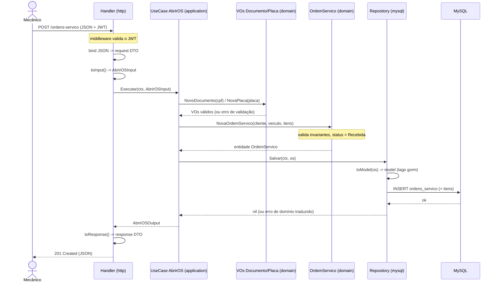

# Arquitetura: Sistema de Oficina Mecânica (Tech Challenge Fase 1)

Back-end monolítico em arquitetura em camadas com DDD tático. Stack: Go, Gin, GORM, MySQL 8.

Versão MVP: o enunciado permite "monolito em camadas". O esqueleto de camadas e o núcleo tático de DDD foram mantidos.

As decisões estruturais (monólito em camadas, MySQL, GORM sem vazamento, Gin, convenção de nomes) estão registradas em `docs/adr/`. Este documento cobre as convenções internas que dão suporte a essas decisões.

---

## Injeção de dependência

- Repositório injetado no use case via construtor, como interface definida no domínio.
- Use case injetado no handler via construtor, como interface definida no handler (o consumidor).

## Três fronteiras de mapeamento

Cada uma dona de uma camada:
1. Handler (infra): HTTP DTO em DTO da aplicação.
2. Use case (aplicação): DTO de entrada em entidade de domínio, nunca vira model.
3. Repositório (infra): entidade em model do GORM.

## Handlers magros: DTO e mapper de transporte

- Para não inflar os handlers, cada agregado tem no pacote `http` dois arquivos além do handler: `*_dto.go` (structs de request/response com tags `json:`) e `*_mapper.go` (converte HTTP DTO em DTO da aplicação, via `toInput()`/`toResponse()`).
- O handler fica magro: bind, `toInput()`, use case, `toResponse()`, resposta.
- Dois DTOs, duas camadas, não confundir: `application/ordemservico/dto.go` são os DTOs da aplicação, contrato do use case, agnóstico de HTTP. `http/ordem_servico_dto.go` são os DTOs de transporte, request/response HTTP. O mapper de transporte é a fronteira 1 entre eles.
- O mapper de transporte é DTO para DTO: nunca importa entidade de domínio nem constrói Value Object, só passa primitivos. A validação (CPF/CNPJ, placa) fica no use case ou no VO. Mantê lo fino, quase uma cópia, é o preço de manter a aplicação agnóstica de transporte.
- Se o pacote `http` crescer demais, dá pra namespacear `http/` por agregado, como na persistência. Custa só aliases de import no `main.go`.

## Regra de dependência

- `infrastructure` importa `application` e `domain`.
- `application` importa só `domain`.
- `domain` não importa nada de dentro do projeto.

## Value Objects auto validáveis

- `Documento` (CPF/CNPJ), `Placa`, `Dinheiro`. Nascem válidos ou não nascem. Validação de dados sensíveis mora aqui.
- `Status`, com máquina de estados, é VO exclusivo da Ordem de Serviço. Vive em `ordemservico/status.go`, não em `shared/`, já que uma Peça não tem "Em diagnóstico".

## Segurança e qualidade

- JWT (`golang-jwt/v5`) nas APIs administrativas.
- Testes de integração com `testcontainers` (MySQL real) e `testify`. Meta de cobertura: 80% ou mais nos domínios críticos.
- Swagger via `swaggo`, migrations via `golang-migrate`.

## Convenção de nomes

Ver [ADR 0005](adr/0005-convencao-de-nomes.md).

---

## Fluxo da aplicação: exemplo criando uma Ordem de Serviço

Sequência de uma requisição de criação de OS atravessando as camadas. Mostra as três fronteiras de mapeamento (HTTP DTO, DTO da aplicação, entidade, model), a validação nos Value Objects e o invariante de status inicial (`Recebida`).



---

## Estrutura de pastas (MVP)

Um agregado (`ordemservico`) é mostrado como referência. Os demais (`cliente`, `veiculo`, `servico`, `peca`) seguem o mesmo padrão.

```
soat-architecture/
├── cmd/api/main.go
├── internal/
│   ├── domain/
│   │   ├── ordemservico/{ordem_servico,status,repository,errors}.go + _test
│   │   ├── cliente/ veiculo/ servico/ peca/  (mesmo padrão)
│   │   └── shared/{documento,placa,dinheiro}.go + _test
│   ├── application/
│   │   ├── ordemservico/{dto,abrir_ordem_servico}.go + _test
│   │   └── cliente/ veiculo/ servico/ peca/  (mesmo padrão)
│   └── infrastructure/
│       ├── persistence/mysql/{connection.go, ordemservico/, cliente/, veiculo/, servico/, peca/}
│       ├── http/{router.go, ordem_servico_handler.go, ordem_servico_dto.go, ordem_servico_mapper.go, middleware/}
│       ├── authentication/jwt.go
│       └── config/config.go
├── migrations/            # schema MySQL versionado (.sql com up/down)
├── test/integration/      # testcontainers (MySQL real)
├── docs/
│   ├── ARQUITETURA.md     # este documento
│   ├── event-storming.md
│   └── adr/               # Architecture Decision Records
├── .env.example
├── Dockerfile
├── compose.yml
├── Makefile
├── go.mod
└── README.md              # como rodar o projeto
```

Migrations: `.sql` versionado em `migrations/` na raiz, onde o avaliador procura. Migration é detalhe de persistência, vive fora do domínio.

Testes: cada pacote tem um `*_test.go` de exemplo, unitário, ao lado do código. Os de integração ficam em `test/integration/`.

## Wiring e rotas

Composição de dependências (config, conexão de banco e, futuramente, repositórios e use cases por domínio) fica centralizada no `Container`, em `internal/infrastructure/wiring/container.go`. É o único lugar que monta o grafo de dependências da aplicação; `main.go` cria o `Container` e passa pra `httpinfra.NewRouter`.

Rotas são registradas por domínio: cada domínio tem seu próprio `<dominio>_routes.go` dentro de `internal/infrastructure/http` (ex: `health_routes.go`), com uma função `Register<Dominio>Routes(rg *gin.RouterGroup, c *wiring.Container)`. `router.go` só monta o `*gin.Engine`, aplica middlewares globais e chama cada `Register*Routes` — não conhece detalhe de nenhum domínio.

Ao implementar um novo domínio (ex: `cliente`):

1. Adicione os campos necessários (repositório, use cases) no `Container` e construa-os em `NewContainer`.
2. Crie `<dominio>_routes.go` com `Register<Dominio>Routes`.
3. Registre a chamada em `router.go`.

