# Modelo de Domínio — Oficina Mecânica

## Visão Geral

Este documento consolida as decisões do modelo de domínio da oficina mecânica. O diagrama foi mantido enxuto e as regras mais detalhadas ficam documentadas abaixo.

## Diagrama de Domínio

```mermaid
classDiagram
direction LR

%% =========================================================
%% AGGREGATE ROOTS
%% =========================================================

class Usuario:::root {
    -id: uint64
    -papel: PapelUsuario
    -nome: string
    -email: Email
    -senha: SenhaHash
    -requerAlterarSenha: bool
    -ativo: bool
    -dataCadastro: DateTime
    -dataAtualizacao: DateTime
    +NewUsuario(...) (Usuario, error)
    +alterarSenha(...) error
    +redefinirSenha(...) error
    +atualizar(...) error
    +ativar()
    +inativar()
}

class Cliente:::root {
    -id: uint64
    -documento: Documento
    -tipo: TipoPessoa
    -nome: string
    -email: Email
    -telefone: Telefone
    -senha: SenhaHash
    -ativo: bool
    -requerAlterarSenha: bool
    -criadoPor: uint64
    -dataCadastro: DateTime
    -dataAtualizacao: DateTime
    +NewCliente(...) (Cliente, error)
    +alterarSenha(...) error
    +atualizar(...) error
    +ativar()
    +inativar()
}

class Veiculo:::root {
    -id: uint64
    -placa: Placa
    -marca: string
    -modelo: string
    -quilometragemAtual: uint32
    -ano: uint16
    -cor: Cor
    -criadoPor: uint64
    -ativo: bool
    -dataCadastro: DateTime
    -dataAtualizacao: DateTime
    +NewVeiculo(...) (Veiculo, error)
    +atualizar(...) error
    +atualizarQuilometragem(quilometragem) error
    +ativar()
    +inativar()
}

class OrdemServico:::root {
    -id: uint64
    -numero: NumeroOrdemServico
    -clienteID: uint64
    -veiculoID: uint64
    -quilometragemEntrada: int
    -status: StatusOrdemServico
    -diagnostico: string?
    -observacoes: string?
    -criadoPor: uint64
    -dataCadastro: DateTime
    -dataAtualizacao: DateTime
    +NewOrdemServico(...) (OrdemServico, error)
    +validarTransicaoPara(novo) error
    +iniciarDiagnostico(alteradoPor) error
    +informarDiagnostico(texto) error
    +enviarParaAprovacao(alteradoPor) error
    +aprovarOrcamento() error
    +rejeitarOrcamento(motivo) error
    +iniciarExecucao(alteradoPor) error
    +entregar(alteradoPor) error
}

class Servico:::root {
    -id: uint64
    -nome: string
    -descricao: string
    -precoBase: float64
    -tempoEstimado: DuracaoEstimada
    -criadoPor: uint64
    -ativo: bool
    -dataCadastro: DateTime
    -dataAtualizacao: DateTime
    +NewServico(...) (Servico, error)
    +atualizar(...) error
    +ativar()
    +inativar()
}

class Peca:::root {
    -id: uint64
    -codigo: string
    -nome: string
    -marca: string
    -descricao: string
    -preco: float64
    -quantidadeEmEstoque: int
    -estoqueMinimo: int
    -criadoPor: uint64
    -ativo: bool
    -dataCadastro: DateTime
    -dataAtualizacao: DateTime
    +NewPeca(...) (Peca, error)
    +atualizar(...) error
    +consumir(quantidade) error
    +repor(quantidade) error
    +ativar()
    +inativar()
}

%% =========================================================
%% ENTITIES
%% =========================================================

class Orcamento:::entity {
    -id: uint64
    -ordemServicoID: uint64
    -valorItemServicos: float64
    -valorItemPecas: float64
    -valorTotal: float64
    -observacoes: string?
    -criadoPor: uint64
    -criadoEm: DateTime
    -atualizadoEm: DateTime
    +NewOrcamento(...) (Orcamento, error)
    +adicionarItemServico(...) error
    +adicionarItemPeca(...) error
    +alterarQuantidadeItemPeca(itemID, quantidade) error
    +removerItemServico(...) error
    +removerItemPeca(...) error
    +calcularTotal() float64
    +validarParaEnvio() error
}

class ItemServico:::entity {
    -id: uint64
    -servicoID: uint64
    -quantidade: int
    -valor: float64
    -tempoEstimado: DuracaoEstimada
    +NewItemServico(...) (ItemServico, error)
    +calcularSubtotal() float64
}

class ItemPeca:::entity {
    -id: uint64
    -pecaID: uint64
    -descricao: string
    -quantidade: int
    -valor: float64
    +NewItemPeca(...) (ItemPeca, error)
    +alterarQuantidade(quantidade) error
    +calcularSubtotal() float64
}

class HistoricoStatus:::entity {
    -id: uint64
    -ordemServicoID: uint64
    -status: StatusOrdemServico
    -alteradoEm: DateTime
    -alteradoPor: uint64
    -motivo: string?
    +NewHistoricoStatus(...) (HistoricoStatus, error)
}

class ReservaPeca:::entity {
    -id: uint64
    -ordemServicoID: uint64
    -pecaID: uint64
    -quantidade: int
    -criadaEm: DateTime
    -atualizadaEm: DateTime
    +NewReservaPeca(...) (ReservaPeca, error)
}

%% =========================================================
%% VALUE OBJECTS
%% =========================================================

class SenhaHash:::vo {
    -hash: string
    +NewSenhaHash(senhaPlana) (SenhaHash, error)
    +Confere(senhaPlana) bool
}

class Documento:::vo {
    -valor: string
    -tipo: TipoPessoa
    +NewDocumento(valor, tipo) (Documento, error)
    +Formatado() string
}

class Placa:::vo {
    -valor: string
    +NewPlaca(valor) (Placa, error)
}

class Email:::vo {
    -valor: string
    +NewEmail(valor) (Email, error)
}

class Telefone:::vo {
    -valor: string
    +NewTelefone(valor) (Telefone, error)
}

class Cor:::vo {
    -valor: string
    +NewCor(valor) (Cor, error)
}

class DuracaoEstimada:::vo {
    -valor: duration
    +NewDuracaoEstimada(valor) (DuracaoEstimada, error)
    +Horas() float64
    +Minutos() int
}

class NumeroOrdemServico:::vo {
    -valor: string
    +NewNumeroOrdemServico(valor) (NumeroOrdemServico, error)
}

%% =========================================================
%% ENUMS
%% =========================================================

class PapelUsuario:::enumc {
    <<enumeration>>
    ADMINISTRADOR
    ATENDENTE
    MECANICO
    CLIENTE
}

class TipoPessoa:::enumc {
    <<enumeration>>
    PF
    PJ
}

class StatusOrdemServico:::enumc {
    <<enumeration>>
    RECEBIDA
    EM_DIAGNOSTICO
    AGUARDANDO_APROVACAO
    APROVADA
    REJEITADA
    EM_EXECUCAO
    FINALIZADA
    ENTREGUE
}

%% =========================================================
%% RELACIONAMENTOS
%% =========================================================

Cliente "1" -- "0..*" OrdemServico : atendimentos
Veiculo "1" -- "0..*" OrdemServico : atendimentos

OrdemServico "1" *-- "0..1" Orcamento
OrdemServico "1" *-- "1..*" HistoricoStatus
OrdemServico "1" *-- "0..*" ReservaPeca : reservas

Orcamento "1" *-- "0..*" ItemServico
Orcamento "1" *-- "0..*" ItemPeca

ItemServico "*" --> "1" Servico
ItemPeca "*" --> "1" Peca
ReservaPeca "*" --> "1" Peca : peca

OrdemServico ..> StatusOrdemServico
HistoricoStatus ..> StatusOrdemServico
Documento ..> TipoPessoa
Usuario ..> PapelUsuario

%% =========================================================
%% REGRAS ESSENCIAIS
%% =========================================================

note for Veiculo "quilometragemAtual = ultima quilometragem conhecida.\nNao pode diminuir."

note for OrdemServico "quilometragemEntrada preserva a quilometragem da abertura.\nCada OS possui no maximo um Orcamento.\nSe REJEITADA, o mesmo Orcamento pode ser editado e reenviado."

note for Orcamento "O Orcamento nao possui status proprio.\nA aprovacao/rejeicao pertence ao status da OS.\nAlterar quantidade de peca apos APROVADA invalida a aprovacao, remove reservas e exige nova aprovacao."

note for Peca "quantidadeEmEstoque representa o estoque fisico.\nAs reservas sao controladas por ReservaPeca.\nconsumir() nao pode deixar o estoque abaixo de estoqueMinimo."

note for ReservaPeca "Representa a quantidade de uma Peca reservada para uma OS aprovada.\nE criada automaticamente a partir dos ItemPeca na aprovacao.\nNao possui operacao publica de alteracao manual.\nUma OS possui no maximo uma reserva por Peca."

note for ItemServico "quantidade permite repetir o mesmo servico\nsem duplicar itens. subtotal = valor * quantidade."

note for Usuario "Entidades e Value Objects sao criados via New...\nO construtor valida as invariantes."

note for OrdemServico "Nao existe metodo finalizar() dedicado.\nA transicao EM_EXECUCAO -> FINALIZADA e permitida pela tabela\nde transicoes (PermiteTransicaoPara) mas nao tem metodo proprio\nno agregado, diferente das demais transicoes."

%% =========================================================
%% ESTILOS
%% =========================================================

classDef root fill:#DDF7E7,stroke:#16803C,stroke-width:2px,color:#111111
classDef entity fill:#E4EEFF,stroke:#4267B2,stroke-width:2px,color:#111111
classDef vo fill:#FFF0DF,stroke:#B5661D,stroke-width:2px,color:#111111
classDef enumc fill:#ECE8FF,stroke:#7357C8,stroke-width:2px,color:#111111

```



## Contextos de apoio (fora do diagrama)

Além dos Aggregate Roots acima, `internal/domain/` tem quatro pacotes que não são agregados de negócio, mas dão suporte a eles:

- **`shared`** = kernel compartilhado: Value Objects `Email`, `SenhaHash`, `DuracaoEstimada`; enum `PapelUsuario`; o framework de erro `AppError`/`ErrorKind` (`not_found`, `validation`, `conflict`, `internal`, `forbidden`, `unauthorized`, `unavailable`) usado por todos os `errors.go` do domínio; as portas `EmailSender` e `TransactionRunner`; e o subpacote `shared/texts` com normalizadores de string (`NormalizeUcFirst`, `NormalizeSpaces`, `NormalizeLower`, `NormalizeUpper`, `OnlyNumbers`).
- **`auth`** = infraestrutura de autenticação: entidade `RefreshToken` (com `EstaValido()`), projeção `Credencial`, `AppClaims` (JWT), enum `TipoUsuario` (`interno`/`cliente`) e as portas `JWTProvider`, `RefreshTokenRepository`, `CredenciaisRepository`, `UsuarioStatusRepository`. Não referencia `usuario`/`cliente` diretamente — usa `UsuarioID uint64` e implementações duplicadas por endpoint.
- **`query`** = contrato de paginação/filtro/ordenação (`Params`, `Filter`, `Page[T]`, enums `Direction` e `Operator`) usado pelos métodos `Listar` de `cliente`, `ordemservico`, `peca`, `servico` e `veiculo`. `usuario`, `orcamento` e `reservapeca` não expõem `Listar`.
- **`relatorio`** = contexto de relatórios: Value Object `Periodo` (valida início antes do fim, fim não futuro, início não anterior a 2026-01-01) e o par `CalcularTransicaoStatusParams`/`TransicaoStatusResultado`, que depende do enum `StatusOrdemServico` de `ordemservico` — a única dependência direta entre pacotes de domínio além de `shared`/`query`.

## Decisões principais

### Construtores e validações

Todas as Entidades e Value Objects devem ser criados pelos construtores `New...`, que validam suas invariantes e retornam erro quando a criação não for válida.

### Identificadores

Os IDs internos serão `uint64` no domínio e `BIGINT UNSIGNED AUTO_INCREMENT` no MySQL. Identificadores de negócio, como `NumeroOrdemServico`, permanecem separados e são gerados pela aplicação.

### Cliente e senha

Cliente possui credencial própria e reutiliza o Value Object `SenhaHash`. A senha em texto puro nunca é persistida; no banco é armazenado apenas `senha_hash VARCHAR(255)`.

Todo cliente é cadastrado com senha provisória e `requerAlterarSenha = true`. Após a primeira troca de senha, essa marcação passa para `false`. A autenticação do cliente é independente da autenticação dos usuários internos.

### Auditoria e persistência do Cliente

`Cliente.criadoPor` identifica o usuário interno autenticado que realizou o cadastro. O valor é obrigatório, deve ser diferente de zero e percorre todas as camadas, do domínio até a persistência.

O domínio expõe uma única porta de persistência para o agregado: `ClienteRepository`. Essa interface concentra as operações de salvar, atualizar e buscar cliente por ID, documento ou e-mail. Os testes usam exclusivamente o mock gerado `mocks.ClienteRepository`; não existe uma interface ou mock genérico chamado `Repository` no domínio de clientes.

### Cliente e Veículo

Cliente e Veículo são Aggregate Roots independentes e não possuem vínculo direto. O relacionamento histórico entre eles ocorre exclusivamente através da Ordem de Serviço.

### Quilometragem

`Veiculo.quilometragemAtual` representa a última quilometragem conhecida e não pode diminuir em condições normais. `OrdemServico.quilometragemEntrada` preserva a quilometragem registrada no momento da abertura da OS.

### Ordem de Serviço e status

Uma OS inicia com `RECEBIDA`.

Fluxo principal:

```text
RECEBIDA
  ↓
EM_DIAGNOSTICO
  ↓
AGUARDANDO_APROVACAO
  ↓
APROVADA
  ↓
EM_EXECUCAO
  ↓
FINALIZADA
  ↓
ENTREGUE
```

Todas as transições têm método próprio no agregado (`IniciarDiagnostico`, `EnviarParaAprovacao`, `AprovarOrcamento`, `IniciarExecucao`, `Entregar`), exceto `EM_EXECUCAO → FINALIZADA`: essa transição é permitida pela tabela `PermiteTransicaoPara`, mas não existe um método `Finalizar()` dedicado no agregado `OrdemServico`.

Fluxo de rejeição:

```text
AGUARDANDO_APROVACAO
  ↓
REJEITADA
  ↓ editar o mesmo orçamento
AGUARDANDO_APROVACAO
```

Fluxo de alteração de peça após aprovação:

```text
APROVADA
  ↓ alterar quantidade de ItemPeca
remover reservas atuais
  ↓
AGUARDANDO_APROVACAO
  ↓ cliente aprova novamente
recriar reservas conforme orçamento
  ↓
APROVADA
```

### Orçamento

Cada Ordem de Serviço possui no máximo um orçamento. O orçamento não possui status próprio: aprovação e rejeição pertencem ao status da OS.

Se rejeitado, o mesmo orçamento pode ser editado e reenviado. Em uma OS `APROVADA`, a edição comum permanece bloqueada; a alteração explícita da quantidade de um `ItemPeca` invalida a aprovação anterior, remove as reservas da OS, move a OS para `AGUARDANDO_APROVACAO` e reenvia o orçamento ao cliente. A nova reserva só é criada após uma nova aprovação.

Na persistência, `UNIQUE(ordem_servico_id)` garante a relação 1:1.

### Histórico de status

Cada mudança relevante gera um `HistoricoStatus` com `status`, `alteradoEm`, `alteradoPor` e `motivo`. Não armazenamos `statusAnterior`.

### Itens do orçamento

`ItemServico` e `ItemPeca` pertencem ao orçamento. Os valores aplicados são preservados no item para que mudanças futuras em Serviço ou Peça não alterem o histórico.

Para ItemServico:

```text
subtotal = valor * quantidade
```

### Estoque

`Peca` mantém somente o estoque físico e o estoque mínimo. A quantidade reservada não é duplicada na peça.

Quantidade disponível:

```text
quantidadeEmEstoque - soma(reservas_pecas.quantidade)
```

Para uma nova reserva:

```text
quantidadeEmEstoque - reservasExistentes - novaQuantidade >= estoqueMinimo
```

Para consumo, a operação também não pode deixar o estoque físico abaixo de `estoqueMinimo`.

`ItemPeca` representa a peça incluída no orçamento e preserva seu valor histórico. Ele não representa uma reserva de estoque.

### Reserva de peça

`ReservaPeca` é uma entidade que representa a quantidade de uma peça comprometida com uma Ordem de Serviço após a aprovação do orçamento. Ela não é manipulada diretamente por endpoint: é criada automaticamente por `AprovarOrcamentoUseCase` a partir das quantidades dos `ItemPeca`.

Se houver mais de um `ItemPeca` para a mesma peça, suas quantidades são agrupadas antes da criação da reserva.

Uma mesma combinação de OS e peça possui no máximo uma reserva corrente:

```text
UNIQUE(ordem_servico_id, peca_id)
```

A tabela `reservas_pecas` é a única fonte de verdade para as quantidades reservadas. Não existe `pecas.quantidade_reservada`. A reserva não possui operação pública de alteração de quantidade; mudanças são feitas no orçamento e exigem nova aprovação quando a OS já estava aprovada.

### Reserva transacional

A criação das reservas e a aprovação da OS ocorrem na mesma transação para impedir que aprovações concorrentes utilizem a mesma disponibilidade.

Fluxo:

```text
BEGIN
  ↓
carregar orçamento e agrupar ItemPeca por pecaID
  ↓
bloquear as peças em ordem de ID (SELECT ... FOR UPDATE)
  ↓
ler reservas correntes da peça com FOR UPDATE
  ↓
somar quantidades reservadas
  ↓
validar: estoque - reservado - quantidadeOrcamento >= estoqueMinimo
  ↓
INSERT reservas_pecas
  ↓
OS = APROVADA
  ↓
COMMIT
```

Em caso de falta de estoque ou qualquer erro: `ROLLBACK`; nem a reserva nem a aprovação parcial permanecem persistidas.

Quando a quantidade de uma peça é modificada após a OS estar `APROVADA`, as reservas atuais são removidas dentro de transação e a OS retorna para `AGUARDANDO_APROVACAO`. A edição não cria a nova reserva: a recriação ocorre somente na aprovação seguinte.

A transação e os locks são responsabilidades da infraestrutura de persistência; a regra de disponibilidade continua protegida pelo domínio/aplicação através de `Peca.PodeReservar`.

### Persistência dos enums

Enums de conjunto fechado são persistidos com `ENUM` no MySQL, incluindo `PapelUsuario`, `TipoPessoa` e `StatusOrdemServico`.

O domínio também mantém seus próprios tipos, protegendo regras e transições, enquanto o banco impede a persistência de valores fora do conjunto permitido.

### Persistência

- MySQL 8 / InnoDB
- IDs com `BIGINT UNSIGNED AUTO_INCREMENT`
- GORM sem `AutoMigrate`
- migrations SQL explícitas com `golang-migrate`
- `DECIMAL` para valores monetários no banco

## Aggregate Roots

- Usuario
- Cliente
- Veiculo
- OrdemServico
- Servico
- Peca

## Entidades internas

- Orcamento
- ItemServico
- ItemPeca
- HistoricoStatus
- ReservaPeca (pacote e repositório próprios, mas conceitualmente entidade interna de OrdemServico — não é Aggregate Root)

## Value Objects

- Documento
- Email
- Telefone
- Placa
- Cor
- SenhaHash
- DuracaoEstimada
- NumeroOrdemServico

## Principais invariantes

**Cliente:** Documento válido, TipoPessoa compatível, Email válido, Telefone válido, SenhaHash válida, `criadoPor` obrigatório e troca da senha provisória sinalizada por `requerAlterarSenha`.

**Veículo:** Placa válida, ano válido, quilometragem não negativa e sem regressão, `criadoPor` obrigatório.

**Ordem de Serviço:** Cliente, Veículo e `criadoPor` obrigatórios, número válido, quilometragem de entrada válida, status inicial `RECEBIDA` e no máximo um orçamento.

**Orçamento:** pertence a uma OS, `criadoPor` obrigatório, pode ser editado antes da aprovação e após rejeição, mas não após aprovação; totais não negativos.

**Peça:** estoque físico e estoque mínimo não negativos, `criadoPor` obrigatório; consumo não pode deixar o estoque abaixo do mínimo.

**ReservaPeca:** OS e peça obrigatórias, quantidade > 0, uma reserva corrente por combinação OS + peça e operação sem violar o estoque mínimo.

**Serviço:** nome e descrição obrigatórios, `precoBase >= 0`, duração estimada válida, `criadoPor` obrigatório.

**ItemServico:** serviço obrigatório, quantidade > 0, valor válido e duração estimada válida.

**ItemPeca:** peça obrigatória, quantidade > 0 e valor válido.

**Usuario:** nome e papel válidos (`PapelUsuario`), email e senha reaproveitam os VOs de `shared`; troca de senha provisória sinalizada por `requerAlterarSenha`.
