# Modelo de Domínio — Oficina Mecânica

## Visão Geral

Este documento consolida as decisões do modelo de domínio da oficina mecânica. O diagrama foi mantido enxuto e as regras mais detalhadas ficam documentadas abaixo.

## Diagrama de Domínio

```mermaid
classDiagram
direction LR

%% =========================================================
%% AGGREGATE ROOTS
%% =========================================================

class Usuario:::root {
    -id: uint64
    -papel: PapelUsuario
    -nome: string
    -email: Email
    -senha: SenhaHash
    -ativo: bool
    -dataCadastro: DateTime
    -dataAtualizacao: DateTime
    +NewUsuario(...) (Usuario, error)
    +alterarSenha(...) error
    +atualizar(...) error
    +ativar()
    +inativar()
}

class Cliente:::root {
    -id: uint64
    -documento: Documento
    -tipo: TipoPessoa
    -nome: string
    -email: Email
    -telefone: Telefone
    -senha: SenhaHash
    -ativo: bool
    -dataCadastro: DateTime
    -dataAtualizacao: DateTime
    +NewCliente(...) (Cliente, error)
    +alterarSenha(...) error
    +atualizar(...) error
    +ativar()
    +inativar()
}

class Veiculo:::root {
    -id: uint64
    -placa: Placa
    -marca: string
    -modelo: string
    -quilometragemAtual: int
    -ano: int
    -cor: Cor
    -ativo: bool
    -dataCadastro: DateTime
    -dataAtualizacao: DateTime
    +NewVeiculo(...) (Veiculo, error)
    +atualizar(...) error
    +atualizarQuilometragem(quilometragem) error
    +ativar()
    +inativar()
}

class OrdemServico:::root {
    -id: uint64
    -numero: NumeroOrdemServico
    -clienteID: uint64
    -veiculoID: uint64
    -quilometragemEntrada: int
    -status: StatusOrdemServico
    -diagnostico: string?
    -observacoes: string?
    -dataCadastro: DateTime
    -dataAtualizacao: DateTime
    +NewOrdemServico(...) (OrdemServico, error)
    +iniciarDiagnostico() error
    +informarDiagnostico(texto) error
    +adicionarServico(...) error
    +adicionarPeca(...) error
    +removerServico(...) error
    +removerPeca(...) error
    +gerarOrcamento() error
    +editarOrcamento(...) error
    +enviarOrcamentoParaAprovacao() error
    +aprovarOrcamento() error
    +rejeitarOrcamento(motivo) error
    +iniciarExecucao() error
    +finalizar() error
    +entregar() error
}

class Servico:::root {
    -id: uint64
    -nome: string
    -descricao: string
    -precoBase: float64
    -tempoEstimado: DuracaoEstimada
    -ativo: bool
    -dataCadastro: DateTime
    -dataAtualizacao: DateTime
    +NewServico(...) (Servico, error)
    +atualizar(...) error
    +ativar()
    +inativar()
}

class Peca:::root {
    -id: uint64
    -codigo: string
    -nome: string
    -marca: string
    -descricao: string
    -preco: float64
    -quantidadeEmEstoque: int
    -estoqueMinimo: int
    -ativo: bool
    -dataCadastro: DateTime
    -dataAtualizacao: DateTime
    +NewPeca(...) (Peca, error)
    +atualizar(...) error
    +consumir(quantidade) error
    +repor(quantidade) error
    +ativar()
    +inativar()
}

%% =========================================================
%% ENTITIES
%% =========================================================

class Orcamento:::entity {
    -id: uint64
    -ordemServicoID: uint64
    -valorItemServicos: float64
    -valorItemPecas: float64
    -valorTotal: float64
    -observacoes: string?
    -criadoEm: DateTime
    -atualizadoEm: DateTime
    +NewOrcamento(...) (Orcamento, error)
    +atualizar(...) error
    +adicionarItemServico(...) error
    +adicionarItemPeca(...) error
    +removerItemServico(...) error
    +removerItemPeca(...) error
    +calcularTotal() float64
}

class ItemServico:::entity {
    -id: uint64
    -servicoID: uint64
    -quantidade: int
    -valor: float64
    -tempoEstimado: DuracaoEstimada
    +NewItemServico(...) (ItemServico, error)
    +alterarQuantidade(quantidade) error
    +calcularSubtotal() float64
}

class ItemPeca:::entity {
    -id: uint64
    -pecaID: uint64
    -descricao: string
    -quantidade: int
    -valor: float64
    +NewItemPeca(...) (ItemPeca, error)
    +alterarQuantidade(quantidade) error
    +calcularSubtotal() float64
}

class HistoricoStatus:::entity {
    -id: uint64
    -ordemServicoID: uint64
    -statusNovo: StatusOrdemServico
    -alteradoEm: DateTime
    -alteradoPor: uint64
    -motivo: string?
    +NewHistoricoStatus(...) (HistoricoStatus, error)
}

class ReservaPeca:::entity {
    -id: uint64
    -ordemServicoID: uint64
    -pecaID: uint64
    -quantidade: int
    -criadaEm: DateTime
    -atualizadaEm: DateTime
    +NewReservaPeca(...) (ReservaPeca, error)
    +alterarQuantidade(quantidade) error
}

%% =========================================================
%% VALUE OBJECTS
%% =========================================================

class SenhaHash:::vo {
    -valor: string
    +NewSenhaHash(valor) (SenhaHash, error)
    +Verificar(senha) bool
}

class Documento:::vo {
    -valor: string
    -tipo: TipoPessoa
    +NewDocumento(valor, tipo) (Documento, error)
    +Formatado() string
}

class Placa:::vo {
    -valor: string
    +NewPlaca(valor) (Placa, error)
}

class Email:::vo {
    -valor: string
    +NewEmail(valor) (Email, error)
}

class Telefone:::vo {
    -valor: string
    +NewTelefone(valor) (Telefone, error)
}

class Cor:::vo {
    -valor: string
    +NewCor(valor) (Cor, error)
}

class DuracaoEstimada:::vo {
    -valor: duration
    +NewDuracaoEstimada(valor) (DuracaoEstimada, error)
    +Horas() float64
    +Minutos() int
}

class NumeroOrdemServico:::vo {
    -valor: string
    +NewNumeroOrdemServico(valor) (NumeroOrdemServico, error)
}

%% =========================================================
%% ENUMS
%% =========================================================

class PapelUsuario:::enumc {
    <<enumeration>>
    ADMINISTRADOR
    ATENDENTE
    MECANICO
}

class TipoPessoa:::enumc {
    <<enumeration>>
    PF
    PJ
}

class StatusOrdemServico:::enumc {
    <<enumeration>>
    RECEBIDA
    EM_DIAGNOSTICO
    AGUARDANDO_APROVACAO
    APROVADA
    REJEITADA
    EM_EXECUCAO
    FINALIZADA
    ENTREGUE
}

%% =========================================================
%% RELACIONAMENTOS
%% =========================================================

Cliente "1" -- "0..*" OrdemServico : atendimentos
Veiculo "1" -- "0..*" OrdemServico : atendimentos

OrdemServico "1" *-- "0..1" Orcamento
OrdemServico "1" *-- "1..*" HistoricoStatus
OrdemServico "1" *-- "0..*" ReservaPeca : reservas

Orcamento "1" *-- "0..*" ItemServico
Orcamento "1" *-- "0..*" ItemPeca

ItemServico "*" --> "1" Servico
ItemPeca "*" --> "1" Peca
ReservaPeca "*" --> "1" Peca : peca

OrdemServico ..> StatusOrdemServico
HistoricoStatus ..> StatusOrdemServico
Documento ..> TipoPessoa
Usuario ..> PapelUsuario

%% =========================================================
%% REGRAS ESSENCIAIS
%% =========================================================

note for Veiculo "quilometragemAtual = ultima quilometragem conhecida.\nNao pode diminuir."

note for OrdemServico "quilometragemEntrada preserva a quilometragem da abertura.\nCada OS possui no maximo um Orcamento.\nSe REJEITADA, o mesmo Orcamento pode ser editado e reenviado."

note for Orcamento "O Orcamento nao possui status proprio.\nA aprovacao/rejeicao pertence ao status da OS.\nApos APROVADA, o Orcamento deixa de ser editavel."

note for Peca "quantidadeEmEstoque representa o estoque fisico.\nAs reservas sao controladas por ReservaPeca.\nconsumir() nao pode deixar o estoque abaixo de estoqueMinimo."

note for ReservaPeca "Representa a quantidade de uma Peca reservada para uma OS.\nDisponibilidade = estoque fisico - soma das reservas.\nUma OS possui no maximo uma reserva por Peca.\nA persistencia deve ser transacional."

note for ItemServico "quantidade permite repetir o mesmo servico\nsem duplicar itens. subtotal = valor * quantidade."

note for Usuario "Entidades e Value Objects sao criados via New...\nO construtor valida as invariantes."

%% =========================================================
%% ESTILOS
%% =========================================================

classDef root fill:#DDF7E7,stroke:#16803C,stroke-width:2px,color:#111111
classDef entity fill:#E4EEFF,stroke:#4267B2,stroke-width:2px,color:#111111
classDef vo fill:#FFF0DF,stroke:#B5661D,stroke-width:2px,color:#111111
classDef enumc fill:#ECE8FF,stroke:#7357C8,stroke-width:2px,color:#111111

```



## Decisões principais

### Construtores e validações

Todas as Entidades e Value Objects devem ser criados pelos construtores `New...`, que validam suas invariantes e retornam erro quando a criação não for válida.

### Identificadores

Os IDs internos serão `uint64` no domínio e `BIGINT UNSIGNED AUTO_INCREMENT` no MySQL. Identificadores de negócio, como `NumeroOrdemServico`, permanecem separados e são gerados pela aplicação.

### Cliente e senha

Cliente possui credencial própria e reutiliza o Value Object `SenhaHash`. A senha em texto puro nunca é persistida; no banco é armazenado apenas `senha_hash VARCHAR(255)`.

### Cliente e Veículo

Cliente e Veículo são Aggregate Roots independentes e não possuem vínculo direto. O relacionamento histórico entre eles ocorre exclusivamente através da Ordem de Serviço.

### Quilometragem

`Veiculo.quilometragemAtual` representa a última quilometragem conhecida e não pode diminuir em condições normais. `OrdemServico.quilometragemEntrada` preserva a quilometragem registrada no momento da abertura da OS.

### Ordem de Serviço e status

Uma OS inicia com `RECEBIDA`.

Fluxo principal:

```text
RECEBIDA
  ↓
EM_DIAGNOSTICO
  ↓
AGUARDANDO_APROVACAO
  ↓
APROVADA
  ↓
EM_EXECUCAO
  ↓
FINALIZADA
  ↓
ENTREGUE
```

Fluxo de rejeição:

```text
AGUARDANDO_APROVACAO
  ↓
REJEITADA
  ↓ editar o mesmo orçamento
AGUARDANDO_APROVACAO
```

### Orçamento

Cada Ordem de Serviço possui no máximo um orçamento. O orçamento não possui status próprio: aprovação e rejeição pertencem ao status da OS.

Se rejeitado, o mesmo orçamento pode ser editado e reenviado. Depois de aprovado, deixa de ser editável.

Na persistência, `UNIQUE(ordem_servico_id)` garante a relação 1:1.

### Histórico de status

Cada mudança relevante gera um `HistoricoStatus` com `statusNovo`, `alteradoEm`, `alteradoPor` e `motivo`. Não armazenamos `statusAnterior`.

### Itens do orçamento

`ItemServico` e `ItemPeca` pertencem ao orçamento. Os valores aplicados são preservados no item para que mudanças futuras em Serviço ou Peça não alterem o histórico.

Para ItemServico:

```text
subtotal = valor * quantidade
```

### Estoque

`Peca` mantém somente o estoque físico e o estoque mínimo. A quantidade reservada não é duplicada na peça.

Quantidade disponível:

```text
quantidadeEmEstoque - soma(reservas_pecas.quantidade)
```

Para uma nova reserva:

```text
quantidadeEmEstoque - reservasExistentes - novaQuantidade >= estoqueMinimo
```

Para consumo, a operação também não pode deixar o estoque físico abaixo de `estoqueMinimo`.

`ItemPeca` representa a peça incluída no orçamento e preserva seu valor histórico. Ele não representa uma reserva de estoque.

### Reserva de peça

`ReservaPeca` é uma entidade que representa a quantidade de uma peça comprometida com uma Ordem de Serviço.

Uma mesma combinação de OS e peça possui no máximo uma reserva corrente:

```text
UNIQUE(ordem_servico_id, peca_id)
```

A tabela `reservas_pecas` é a única fonte de verdade para as quantidades reservadas. Não existe `pecas.quantidade_reservada`.

### Reserva transacional

A persistência da reserva deve ocorrer em uma transação para impedir que duas operações concorrentes utilizem a mesma disponibilidade.

Fluxo:

```text
BEGIN
  ↓
SELECT peça FOR UPDATE
  ↓
consultar SUM(reservas_pecas.quantidade)
  ↓
validar estoque mínimo
  ↓
INSERT/UPDATE reservas_pecas
  ↓
COMMIT
```

Em caso de erro: `ROLLBACK`.

A transação e o bloqueio são responsabilidades da infraestrutura de persistência; a regra que determina se a reserva é válida continua protegida pelo domínio/aplicação.

### Persistência dos enums

Enums de conjunto fechado são persistidos com `ENUM` no MySQL, incluindo `PapelUsuario`, `TipoPessoa` e `StatusOrdemServico`.

O domínio também mantém seus próprios tipos, protegendo regras e transições, enquanto o banco impede a persistência de valores fora do conjunto permitido.

### Persistência

- MySQL 8 / InnoDB
- IDs com `BIGINT UNSIGNED AUTO_INCREMENT`
- GORM sem `AutoMigrate`
- migrations SQL explícitas com `golang-migrate`
- `DECIMAL` para valores monetários no banco

## Aggregate Roots

- Usuario
- Cliente
- Veiculo
- OrdemServico
- Servico
- Peca

## Entidades internas

- Orcamento
- ItemServico
- ItemPeca
- HistoricoStatus
- ReservaPeca

## Value Objects

- Documento
- Email
- Telefone
- Placa
- Cor
- SenhaHash
- DuracaoEstimada
- NumeroOrdemServico

## Principais invariantes

**Cliente:** Documento válido, TipoPessoa compatível, Email válido, Telefone válido e SenhaHash válida.

**Veículo:** Placa válida, ano válido, quilometragem não negativa e sem regressão.

**Ordem de Serviço:** Cliente e Veículo obrigatórios, número válido, quilometragem de entrada válida, status inicial `RECEBIDA` e no máximo um orçamento.

**Orçamento:** pertence a uma OS, pode ser editado antes da aprovação e após rejeição, mas não após aprovação; totais não negativos.

**Peça:** estoque físico e estoque mínimo não negativos; consumo não pode deixar o estoque abaixo do mínimo.

**ReservaPeca:** OS e peça obrigatórias, quantidade > 0, uma reserva corrente por combinação OS + peça e operação sem violar o estoque mínimo.

**ItemServico:** serviço obrigatório, quantidade > 0, valor válido e duração estimada válida.

**ItemPeca:** peça obrigatória, quantidade > 0 e valor válido.
